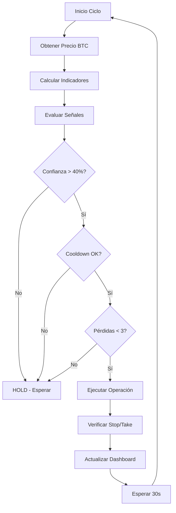

# 🤖 AI Trading Simulator - Estrategias y Frecuencias

## 📈 ESTRATEGIAS DE TRADING

### 🧠 **Algoritmo Principal: Multi-Indicador con Gestión de Riesgo**

El bot utiliza una estrategia híbrida que combina múltiples indicadores técnicos con un sistema avanzado de gestión de riesgo.

---

## 🔍 **INDICADORES TÉCNICOS UTILIZADOS**

### **1. SMA (Simple Moving Average) - Tendencia**
```javascript
// Periodos utilizados
SMA20 = Promedio móvil simple de 20 períodos
SMA50 = Promedio móvil simple de 50 períodos

// Lógica de señales
if (precio > SMA20 && SMA20 > SMA50) → SEÑAL ALCISTA (+20% confianza)
if (precio < SMA20 && SMA20 < SMA50) → SEÑAL BAJISTA (+20% confianza)
```

### **2. RSI (Relative Strength Index) - Momentum**
```javascript
// Configuración
Período: 14 períodos
Rangos: 0-100

// Señales de entrada
RSI < 30 → SOBREVENTA → COMPRAR (+25% confianza)
RSI > 70 → SOBRECOMPRA → VENDER (+25% confianza)
```

### **3. MACD (Moving Average Convergence Divergence)**
```javascript
// Componentes
EMA12 - EMA26 = Línea MACD
Cruces y momentum

// Señales
MACD > MACD_anterior && MACD > 0 → COMPRAR (+15% confianza)
MACD < MACD_anterior && MACD < 0 → VENDER (+15% confianza)
```

### **4. EMA (Exponential Moving Average)**
```javascript
// Periodos
EMA12 = Media móvil exponencial rápida
EMA26 = Media móvil exponencial lenta

// Uso: Base para cálculo del MACD
```

### **5. Bollinger Bands - Volatilidad**
```javascript
// Configuración
Período: 20
Desviación estándar: 2

// Uso: Identificación de niveles de sobrecompra/sobreventa
```

---

## ⚡ **LÓGICA DE DECISIÓN**

### **🎯 Sistema de Confianza Ponderado**
```javascript
// Acumulación de señales
Confianza Total = SMA(20%) + RSI(25%) + MACD(15%)

// Umbral mínimo
if (confianza >= 40%) → EJECUTAR OPERACIÓN
if (confianza < 40%) → MANTENER POSICIÓN (HOLD)

// Señal final
if (señales_compra > señales_venta && confianza > 30%) → COMPRAR
if (señales_venta > señales_compra && confianza > 30%) → VENDER
else → HOLD
```

### **📊 Ejemplo de Análisis Real**
```
🔍 Análisis Actual:
├── Precio BTC: $67,234
├── SMA20: $66,890 (Precio > SMA20 ✅)
├── SMA50: $65,450 (SMA20 > SMA50 ✅)
├── RSI: 45.2 (Neutral, no señal)
├── MACD: +0.23 (Alcista ✅)
└── Confianza Total: 55% → COMPRAR
```

---

## 🛡️ **GESTIÓN DE RIESGO**

### **💰 Configuración de Capital**
```javascript
settings = {
    maxPositionSize: 0.8,     // Máximo 80% del capital en BTC
    stopLoss: 0.05,           // Stop loss automático del 5%
    takeProfit: 0.10,         // Take profit automático del 10%
    riskPerTrade: 0.02,       // Máximo 2% del capital por operación
    minConfidence: 40,        // Confianza mínima para operar (40%)
    cooldownPeriod: 300000,   // 5 minutos entre operaciones
    maxConsecutiveLosses: 3   // Máximo 3 pérdidas consecutivas
}
```

### **⚠️ Controles de Seguridad**
1. **Position Sizing**: Nunca más del 80% en BTC
2. **Risk per Trade**: Máximo 2% del capital por operación
3. **Minimum Trade**: $10 mínimo por operación
4. **Cooldown Period**: 5 minutos entre trades
5. **Loss Limit**: Para después de 3 pérdidas consecutivas
6. **Stop Loss**: Venta automática con 5% de pérdida
7. **Take Profit**: Venta automática con 10% de ganancia

---

## ⏰ **FRECUENCIAS DE ACTUALIZACIÓN**

### **🔄 Ciclos del Sistema**

#### **📊 Análisis de Mercado**
```javascript
// Bot de trading
Frecuencia: Cada 30 segundos
Función: executeStrategy()
Actividad: 
├── Obtener precio actual de Bitcoin
├── Calcular indicadores técnicos
├── Evaluar señales de compra/venta
├── Ejecutar operaciones si procede
└── Verificar stop-loss y take-profit
```

#### **💹 Datos de Mercado**
```javascript
// Servidor principal
Frecuencia: Cada 30 segundos
Función: startMarketDataUpdates()
Fuente: CoinGecko API
Datos obtenidos:
├── Precio actual BTC/USD
├── Cambio 24h (%)
├── Volumen 24h
└── Timestamp de actualización
```

#### **📱 Dashboard Web**
```javascript
// Cliente (navegador)
Frecuencia: Cada 30 segundos vía WebSocket
Actualización automática:
├── Métricas del portafolio
├── Estado del bot (activo/inactivo)
├── Últimas operaciones
├── Indicadores técnicos actuales
└── Log de actividad en tiempo real
```

#### **📈 Reportes de Estado**
```javascript
// Logs automáticos
Frecuencia: Cada 5 minutos
Información:
├── Balance actual
├── Cantidad de BTC
├── Rendimiento total (%)
└── Estado general del sistema
```

---

## 📋 **FLUJO DE OPERACIÓN**

### **🔄 Ciclo Completo (Cada 30 segundos)**



### **💡 Ejemplo de Timeline Real**
```
⏰ 10:00:00 - Análisis iniciado
    ├── 📊 Precio: $67,234 (CoinGecko API)
    ├── 🧮 SMA20: $66,890 | SMA50: $65,450
    ├── 📈 RSI: 45.2 | MACD: +0.23
    └── ✅ Señal: COMPRAR (Confianza: 55%)

⏰ 10:00:15 - Validación de riesgo
    ├── ✅ Position size OK (60% < 80%)
    ├── ✅ Cooldown OK (>5min desde último trade)
    ├── ✅ Balance suficiente ($2,400 disponible)
    └── ✅ Riesgo aceptable (2% = $200)

⏰ 10:00:30 - Ejecución
    ├── 💰 Compra: 0.00297 BTC × $67,234
    ├── 💵 Monto: $200 + $0.20 fee
    ├── 🛡️ Stop loss: $63,872 (-5%)
    ├── 🎯 Take profit: $73,957 (+10%)
    └── 📊 Dashboard actualizado

⏰ 10:01:00 - Siguiente ciclo...
```

---

## 🎛️ **PARÁMETROS CONFIGURABLES**

### **⚙️ Ajustes del Bot** (vía API)
```json
{
  "maxPositionSize": 0.8,      // % máximo del capital
  "stopLoss": 0.05,            // % de stop loss
  "takeProfit": 0.10,          // % de take profit  
  "minConfidence": 40,         // % mínimo de confianza
  "cooldownPeriod": 300000,    // ms entre operaciones
  "riskPerTrade": 0.02         // % del capital por trade
}
```

### **📊 Configuración de Indicadores**
```javascript
// Períodos personalizables
SMA: [20, 50] períodos
EMA: [12, 26] períodos  
RSI: 14 períodos
Bollinger: 20 períodos, 2σ
MACD: EMA12 - EMA26
```

---

## 📈 **PERFORMANCE Y MÉTRICAS**

### **🎯 KPIs en Tiempo Real**
- **ROI Total**: Rendimiento desde inicio
- **Win Rate**: % de operaciones exitosas
- **Sharpe Ratio**: Retorno ajustado por riesgo
- **Max Drawdown**: Mayor pérdida temporal
- **Operaciones/día**: Frecuencia de trading
- **Avg Hold Time**: Tiempo promedio de posición

### **📊 Ejemplo de Métricas**
```
📈 Performance Actual:
├── ROI Total: +3.47%
├── Win Rate: 68.4%
├── Total Trades: 23
├── Sharpe Ratio: 1.23
├── Max Drawdown: -2.1%
└── Avg Position: 4.2 horas
```

---

## 🚀 **VENTAJAS DE LA ESTRATEGIA**

### **✅ Fortalezas**
1. **Multi-indicador**: Reduce falsos positivos
2. **Gestión de riesgo**: Protege el capital
3. **Adaptativo**: Responde a diferentes condiciones
4. **Backtesting**: Basado en patrones históricos
5. **Tiempo real**: Datos actualizados constantemente

### **⚠️ Limitaciones**
1. **Mercado lateral**: Menos efectivo en rangos
2. **Volatilidad extrema**: Puede generar pérdidas
3. **Dependencia de APIs**: Requiere conectividad
4. **Simulación**: No considera slippage real

---

## 🔮 **FUTURAS MEJORAS**

### **📈 Estrategias Avanzadas**
- [ ] Machine Learning con redes neuronales
- [ ] Análisis de sentimiento de noticias
- [ ] Arbitraje entre exchanges
- [ ] Estrategias de grid trading
- [ ] DCA (Dollar Cost Averaging) inteligente

### **🔧 Optimizaciones Técnicas**
- [ ] Backtesting histórico completo
- [ ] Optimización de parámetros automática
- [ ] Múltiples timeframes
- [ ] Integración con más exchanges
- [ ] Paper trading con datos reales

---

**🎯 Resultado**: Una estrategia robusta y bien definida que combina análisis técnico clásico con gestión moderna de riesgo, ejecutándose en tiempo real cada 30 segundos.**